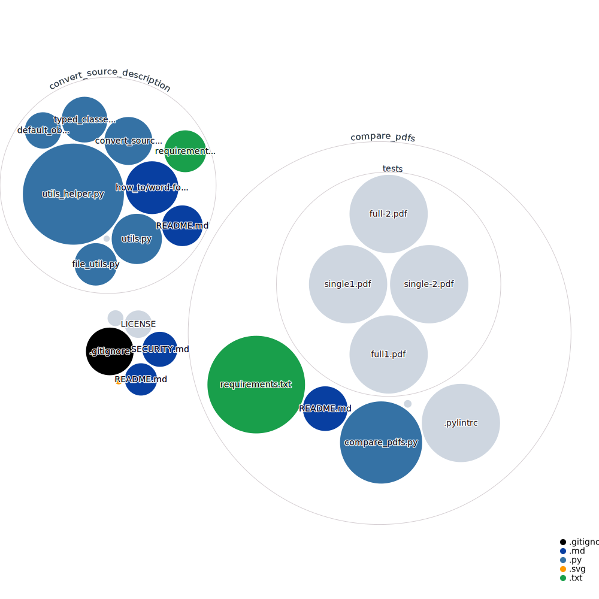

# awg-utils


[](https://scorecard.dev/viewer/?uri=github.com/webern-unibas-ch/awg-utils)
[](https://deepwiki.com/webern-unibas-ch/awg-utils)

A repo for utility scripts of the Anton Webern Gesamtausgabe.

---

## Virtual enironments

### Activating a Virtual Environment

1. Navigate to the target folder:

```bash
cd /d/Repositories/webern-unibas-ch/awg-utils/compare_pdfs
```

2. Create a virtual environment:

```bash
python -m venv .venv
```

3. Activate the virtual environment:

```bash
source .venv/Scripts/activate
```

4. Install the dependencies:

```bash
pip install -r requirements.txt --require-hashes
```

### Deactivating a Virtual Environment

To deactivate the currently active virtual environment, simply run:

```bash
deactivate
```

## [SCRIPT]: convert_source_description

The python script in this folder converts a source description given in Word format from .docx to .json. 

See [HOW TO ... convert source-descriptions from WORD to JSON?](convert_source_description/README.md)

## [SCRIPT]: compare_pdfs

The python script in this folder compares the pages of two pdfs and highlights any diffs.

See [HOW TO ... compare two PDF files and highlight differences?](compare_pdfs/README.md)

## Repository structure


